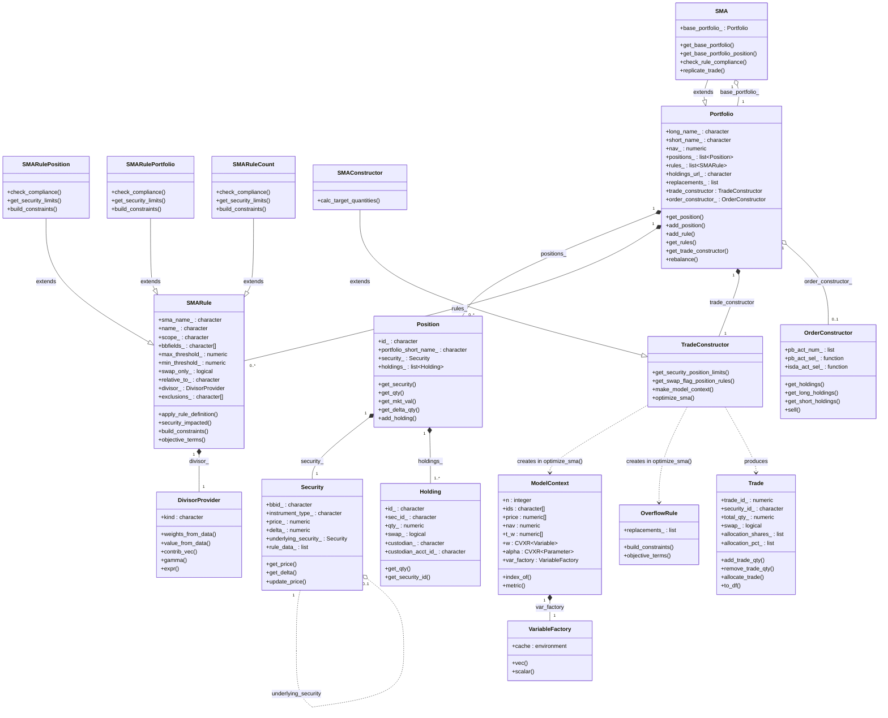

# SMA Manager — Class Diagram

## Legend

| Symbol | Meaning |
|--------|---------|
| `--|>` | Inheritance (is-a) |
| `*--`  | Composition (owns, lifecycle tied) |
| `o--`  | Aggregation (references, independent lifecycle) |
| `..>`  | Dependency (creates/uses transiently) |
| `..o`  | Optional self-reference |

## Quick Reference

| Class | Role |
|-------|------|
| **Security** | Leaf asset with price, delta, Bloomberg data |
| **Holding** | Single custodian lot of a security |
| **Position** | Aggregated view across all lots for one security |
| **Portfolio** | Base container: positions + rules + optimizer |
| **SMA** | Portfolio that tracks a base portfolio and enforces rules |
| **SMARule** | Constraint definition (position, portfolio, or count scope) |
| **DivisorProvider** | Denominator for rule weights (NAV / GMV / long GMV / short GMV) |
| **TradeConstructor** | Builds and runs the CVXR optimization |
| **SMAConstructor** | SMA-specific override of TradeConstructor |
| **ModelContext** | Optimization state: variables, prices, targets |
| **VariableFactory** | Cached CVXR variable allocator |
| **OverflowRule** | Redirects trades to replacement securities |
| **OrderConstructor** | Produces order allocations across broker accounts |
| **Trade** | Output: a security trade with portfolio allocations |
